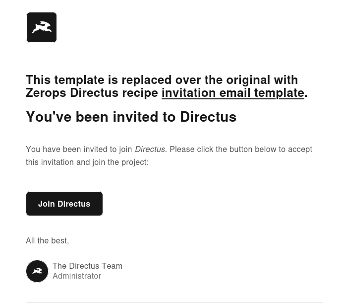

# Zerops x Directus

## Migrations

Using snapshots seems as a viable way to keep your Directus instances up to date: https://docs.directus.io/self-hosted/cli.html#migrate-schema-to-a-different-environment

> By applying the snapshot, Directus will auto-detect the changes required to make the current instance up to date with the proposed data model in the snapshot file, and will run the required migrations to the database to make it match the snapshot.

- make a copy of `.env.example` named `.env` and change the `DB_PASSWORD` variable with password from GUI (Database Service > Access Details)
- make sure you have Zerops command-line tool `zcli` [installed](https://docs.zerops.io/references/cli) and you are logged-in to your account
- run following commands:
```shell
zcli vpn up
npx directus schema snapshot > snapshot.yaml
```

This recipe comes with simple showcase setup with "images" collection - contained in `snapshot.yaml`.
Migrations (via `snapshot.yaml`) are automatically applied after every deployment in `run.initCommands` section.

## Taking over

Feel free to fork this repository, make changes to your Directus instance and then snapshot made changes via `snapshot.yaml` to get adjusted ready-to-go instances of Directus.

## Email templates

If you wish to override the default emails sent by Directus, add file to `./templates` corresponding to [base Directus templates](https://github.com/directus/directus/tree/main/api/src/services/mail/templates).
As showcased with the `./templates/user-invitation.liquid` file.

